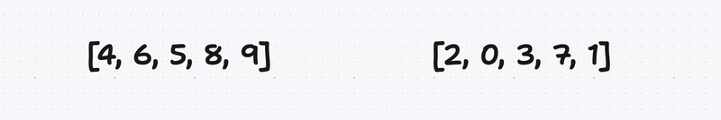

# Ex01 : RPN :

دابا حنا فاش كانبغيوا نعطيوا الأولوية للشي عملية بحال الضرب و لا القسمة كانديروا الأقواس و العملية (+, -, *, /) كاتكون وسط الأرقام, فال RPN كاتبدل القضية و كانحيدوا الحاجة  للأقواس بحيت كانبقاو نقراو من اليسار الى اليمين وما كانديروا شي عملية تاكنلقاو 2 أعداد من وراهم Operator

هاد الكتابة كاتستعمل فبعض الCalculators و Computers  حيتاش كيحتاجو غير شويا ديال ال Charachters باش يخدموا و فبعض للغات البرمجة كPostScript

هاد الكتابة سريعة و من بين الأسباب علاش انها كتحتاج معلومات قلال لي تخزنهم متلا ايلا بغينا نديرو 2 * 3 - 5 غادي نحتاجو 9 ديال ((5 - 3) * 2) فبلاصة غي 5 بحال * 2 - 3 5 و حيتاش كاينين معلومات قلال يعني وقت قليل باش يخدم الProgram

# Ex02 : Ford Johnson Sort :

We Have a unsorted vector (or any container) :

We create a vector of pairs of unsigned integers (because the value to be inserted are positives) 

Then we take a vector of pairs of unsigned integers and swaps the first and second elements if the first element is greater than the second element

After that we take a vector of pairs of unsigned integers and extracts the second element of each pair into a new vector called the largest and the first element of each pair into a new vector called smallest.

It’s up to you to choose which one to sort, i choose the largest

Now start to insert the elements of largest to smallest by using lower_bound to get its position and the member function insert to insert.

let's start by defining what's a container ??

Container ?
A container in C++ is a class template that stores a collection of other objects (elements), and provides member functions to access and manipulate them. The C++ Standard Library provides a variety of container classes that can be used to store and manipulate collections of objects, including sequential containers, associative containers, and unordered associative containers.

deque is the double-ended queue container provided by C++ Standard Template Library (STL), it is similar with vector container, but if you want to add a new element to the beginning in a vector, the time complexity is O(N), but in a deque it is O(1).

deque can automatically expand the space when we need to store more elements, so that we don’t have to worry about the size of the queue.

- std::deque is a good choice when you need a container that supports efficient insertion and deletion at both ends

- std::vector is a good choice when you need a container that supports efficient random access

- Random access refers to the ability to access any element in a container in constant time, regardless of its position in the container, In C++, std::vector provides random access, meaning that you can access any element in a vector in constant time using the [] operator. This is because std::vector stores its elements in a contiguous block of memory, allowing for efficient random access.

# Ressources :

## RPN
https://isaaccomputerscience.org/concepts/dsa_datastruct_stack?examBoard=all&stage=all

https://isaaccomputerscience.org/concepts/dsa_toc_rpn?examBoard=all&stage=all

https://www.dcode.fr/reverse-polish-notation

## Ford Johnson

https://codereview.stackexchange.com/questions/116367/ford-johnson-merge-insertion-sort

https://github.com/PunkChameleon/ford-johnson-merge-insertion-sort

https://github.com/decidedlyso/merge-insertion-sort/blob/master/README.md

## STL

# Benchmarking

http://blog.davidecoppola.com/2014/05/cpp-benchmarks-vector-vs-list-vs-deque/

# Deque

https://clay-atlas.com/us/blog/2021/09/28/cpp-en-how-to-use-deque-stl/

https://stackoverflow.com/questions/5345152/why-would-i-prefer-using-vector-to-deque
